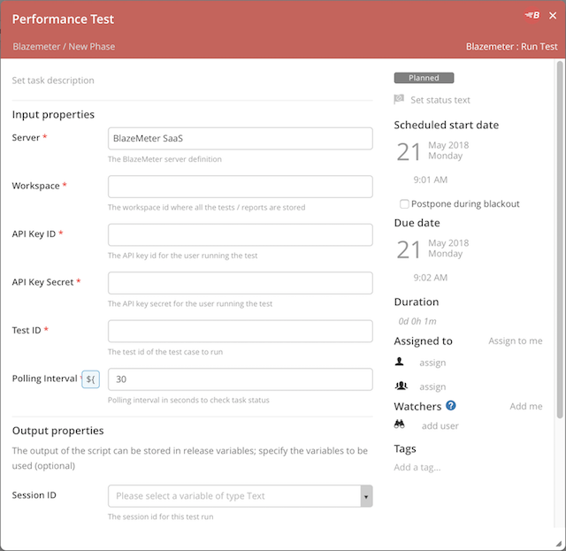

# xlr-blazemeter-plugin

[![License: MIT][xlr-blazemeter-plugin-license-image]][xlr-blazemeter-plugin-license-url]
[![Github All Releases][xlr-blazemeter-plugin-downloads-image]]()

[xlr-blazemeter-plugin-license-image]: https://img.shields.io/badge/License-MIT-yellow.svg
[xlr-blazemeter-plugin-license-url]: https://opensource.org/licenses/MIT
[xlr-blazemeter-plugin-downloads-image]: https://img.shields.io/github/downloads/xebialabs-community/xlr-blazemeter-plugin/total.svg

# XL Release BlazeMeter Plugin

## Preface

This document describes the functionality provide by the `xlr-blazemeter-plugin`

## Overview

This module offers a basic interface to BlazeMeter functionality.

## XL Release Scenario

BlazeMeter markets a commercial, self-service load testing platform as a service (PaaS), which is compatible with open-source Apache JMeter, the performance testing framework from the Apache Software Foundation. BlazeMeter comes with a well documented API layer with integration into a number of testing frameworks, incl. JMeter, Gatling, Selenium and Taurus. Therefore this plugin is focused on a narrow use case: single JMeter test that are specified inline the XLR task.

### Design decisions on plugin scope

The current version ONLY supports a single Test run. The other type of test that is not supported currently is called a Multi Test. A Multi Test is used for distributed load testing.

## Installation

1. Copy the plugin JAR file into the `SERVER_HOME/plugins` directory of XL Release.
2. Configure your BlazeMeter URL and API Key in Shared Configuration.

## Available Tasks

### Run BlazeMeter Test Case

The **BlazeMeter: Run a Test** task type runs a preconfigured load test. It requires you to specify the following information:

* The Api Key which identifies the user 'id:secret' associated with the project / workspace.
* The Test ID to identify the test.
* The Workspace ID for the tests / reports
* The desired polling interval to check for updates

[Optional] You can also capture the session ID for debugging purposes. This can be used to retrieve all assets remotely.

## References:
* [BlazeMeter REST APIs](https://guide.blazemeter.com/hc/en-us/articles/206732689-BlazeMeter-REST-APIs)
